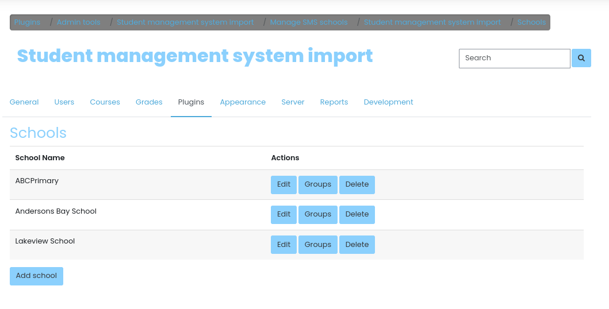
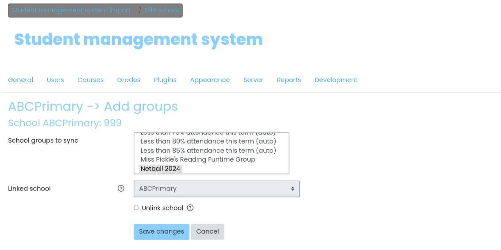
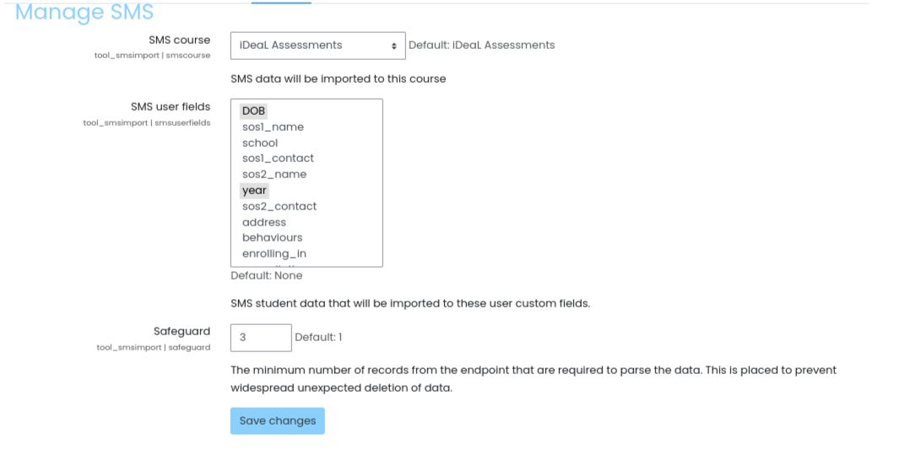
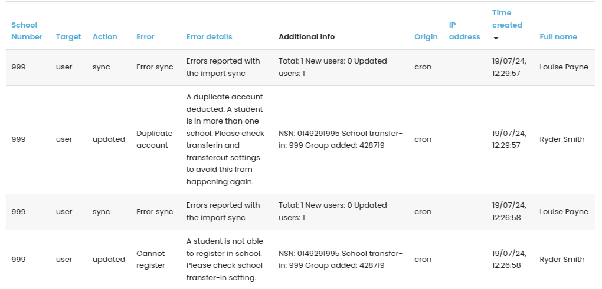

# moodle-tool_smsimport

Student management system import

This plugin allows Moodle LMS to be integrated with multiple student management systems (SMS).
This will allow a Moodle site to import student records from the different SMS. The student records will be automatically updated on a daily basis.
This allows to create a school which is linked to a cohort and then add user accounts to it.

It currently supports [Edge SMS](https://www.edgelearning.co.nz/products-1/edge-sms/edge-sms) and [eTAP SMS](https://www.etap.co.nz/).
Subscription will be needed with the respective SMS

# Installation

Add the plugin to /admin/tool/

Run the Moodle upgrade.

# Configuration
The plugin can be configured from Admin -> Plugins -> Admin tools -> Student management system import -> Manage SMS
* Manage SMS import -> admin/settings.php?section=tool_smsimport_managesms

# Setup

## Add SMS

Add student management system -> admin/tool/smsimport/addsms.php

## Add school

Manage SMS import schools -> admin/tool/smsimport/index.php
    You add / edit / delete schools
    You add groups to a school

## Build a SMS import report
    Go to log report ->  Admin -> Reports -> Custom reports -> Source -> SMS logs

## Schedule task to import the users
    \tool_smsimport\task\import_sms_users
    SMS import schedule tasks. Runs at 12am daily

## Schedule task to clean-up users from incorrect group
    \tool_smsimport\task\cleanup_sms_users
    SMS import schedule tasks. Runs at 1am daily

## Create user custom profiles
Admin -> User -> user profile fields
* dob -> Date/Time
* school -> Text input
* year -> Text input
* room -> Text input
* gender -> Drop-down Menu
    Values:
    Male, Female, Not Specified
* ethnicity -> Text input

# Screenshots

# Contributing and support

Issues, and pull requests using github are welcome and encouraged!

https://github.com/catalyst/moodle-tool_smsimport/issues

A developer can extend this plugin to add other SMS to it.